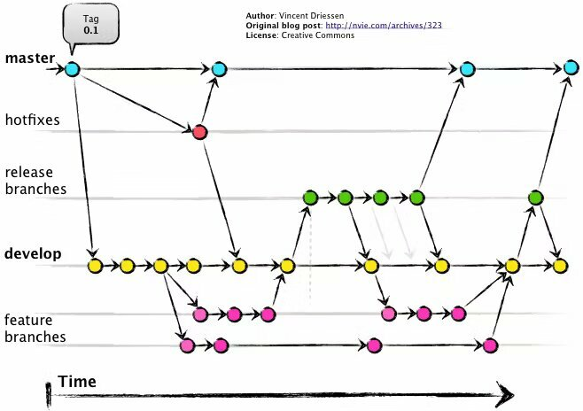

#

<br>

## 🧐 기획 의도

### ✅ 사용자 맞춤화 부족

### ✅ 직관성 결여

### ✅ 기술적 장벽

<br>

## 시연 영상

## :technologist: Team

|                                                               **남승현**                                                               |                                                                **노영재**                                                                 |                                                               **서용준**                                                               |                                                                   **이정민**                                                                    |
| :------------------------------------------------------------------------------------------------------------------------------------: | :---------------------------------------------------------------------------------------------------------------------------------------: | :------------------------------------------------------------------------------------------------------------------------------------: | :---------------------------------------------------------------------------------------------------------------------------------------------: |
| [ <br/> @namsh1125](https://github.com/namsh1125) | [ <br/> @YoungjaeRo](https://github.com/YoungjaeRo) | [ <br/> @mango0422](https://github.com/mango0422) | [ <br/> @jeongmin07262](https://github.com/jeongmin07262) |

<br>

## UI 스타일 가이드라인

1. **폰트**

   - 기본 폰트: `Arial`, `Helvetica`, `sans-serif`.
   - 크기: 기본 텍스트는 `16px`, 제목은 `24px` 이상.

2. **컬러 배색**
   <!-- 테스트로 작성한 것. 추후 수정 필 -->

   - 주 색상: `#3498db` (파란색)
   - 보조 색상: `#2ecc71` (녹색), `#e74c3c` (빨간색)

3. **여백**
   - 들여쓰기: 2space (Soft Tab 사용)
   - 코드 그룹 간 빈 줄: 한 줄 삽입
   - 주요 섹션 사이: 20px 이상의 간격 추가

## Convention

### [prettier-vscode에서-저장만하면-자동으로-적용하는법](how-to-prettier.md)

사실 그냥 매번 코드 작성 후 `pnpm format` 만 실행해도 되지만 개발의 귀찮음을 덜어주기 위한 장치.

### File

1. **폴더 구조**

   - 컴포넌트, 페이지, 유틸리티 등을 명확히 분리하여 유지보수를 용이하게 함.
   - 예시:
     ```plaintext
     src/
     ├── components/    # 재사용 가능한 컴포넌트
     ├── pages/         # 개별 화면 구성 요소
     ├── utils/         # 유틸리티 함수
     └── assets/        # 이미지, 폰트 등 정적 파일
     ```

2. **네이밍 규칙**

   - **파일 및 폴더 이름**:

     - 파일 이름: `PascalCase` (컴포넌트, 클래스)
     - 폴더 이름: `camelCase` 또는 `kebab-case`
     - 예시:
       ```plaintext
       ControlPanel.jsx, useCheckboxProps.js
       ```

   - **TailwindCSS 클래스**:

     - TailwindCSS를 사용하기 때문에 BEM 방식 대신 유틸리티 클래스 기반으로 작성.
     - Prettier와 `prettier-plugin-tailwindcss`를 활용하여 자동 정렬.
     - 클래스 예시:
       ```html
       <div
         class="rounded-md bg-blue-500 p-4 text-white shadow-lg hover:bg-blue-700"
       ></div>
       ```
     - 저장 시 TailwindCSS 클래스가 자동으로 정렬됩니다:

       ```html
       <!-- Before -->
       <div
         class="rounded-md bg-blue-500 p-4 text-white shadow-lg hover:bg-blue-700"
       ></div>

       <!-- After -->
       <div
         class="rounded-md bg-blue-500 p-4 text-white shadow-lg hover:bg-blue-700"
       ></div>
       ```

3. **기본 규칙**
   - 한 파일당 하나의 주요 기능/컴포넌트만 작성.
   - 파일 크기가 200줄을 초과하면 적절히 분리.
   - 주석은 주요 로직 및 의도를 설명하는 데 사용하며, 함수와 클래스 정의 시 최소 한 줄 이상 작성.
   - 파일 끝에 빈 줄 추가.

### Branch Strategy



저희는 Git Flow 전략을 기반으로 개발을 진행하였습니다.  
다만, 현재 프로젝트는 배포 계획이 없으므로 **Release 브랜치**는 사용하지 않았습니다.

### Commit Message

Commit Message는 다음의 형식을 따르며,

```
<이모지> <커밋 메시지>
```

이모지는 다음의 표를 참고하여 사용합니다.

| **이모지** | **의미**             | **설명**                                               | **예시**                            |
| ---------- | -------------------- | ------------------------------------------------------ | ----------------------------------- |
| 🎨         | 코드 구조/형식 개선  | 코드의 기능 변경 없이 리팩토링이나 코드 스타일을 개선. | `🎨 CSS 클래스 이름 리팩토링`       |
| ✨         | 새로운 기능 추가     | 기존 코드에 새로운 기능을 추가.                        | `✨ 사용자 인증 기능 추가`          |
| 🐛         | 버그 수정            | 코드의 버그를 수정.                                    | `🐛 로그인 버튼 오류 수정`          |
| 📝         | 문서화               | README, 주석 등 문서와 관련된 작업.                    | `📝 API 문서 업데이트`              |
| 💄         | UI/스타일 수정       | CSS 변경 등 사용자에게 보이는 부분의 스타일 변경.      | `💄 버튼 색상 업데이트`             |
| 🔧         | 설정 파일 수정       | ESLint, Prettier 등 설정 파일 변경.                    | `🔧 ESLint 규칙 업데이트`           |
| ✅         | 테스트 추가/수정     | 테스트 코드와 관련된 작업.                             | `✅ 로그인에 대한 단위 테스트 추가` |
| 🔥         | 코드 및 파일 삭제    | 불필요한 코드나 파일 삭제.                             | `🔥 사용하지 않는 CSS 파일 삭제`    |
| ♻️         | 코드 리팩토링        | 성능 개선, 가독성 향상을 위해 기존 코드 수정.          | `♻️ 인증 로직 리팩토링`             |
| ⚡         | 성능 개선            | 속도나 효율성을 개선하기 위한 코드 변경.               | `⚡ 데이터베이스 쿼리 속도 개선`    |
| 🚑         | 긴급 수정            | 치명적인 문제나 버그를 빠르게 수정.                    | `🚑 홈페이지 깨짐 문제 핫픽스`      |
| 📦         | 패키지 추가/업데이트 | npm, Yarn 등 패키지 매니저를 통한 패키지 변경.         | `📦 React 버전 업그레이드`          |
| 🎉         | 초기 작업            | 프로젝트의 초기 설정 및 파일 추가.                     | `🎉 프로젝트 초기화`                |
| 🚚         | 파일/폴더 이동       | 파일이나 폴더의 위치를 변경.                           | `🚚 에셋 폴더 이동`                 |
| ➕         | 종속성 추가          | 새로운 라이브러리나 종속성 추가.                       | `➕ lodash 종속성 추가`             |
| ➖         | 종속성 제거          | 사용하지 않는 라이브러리나 종속성 제거.                | `➖ jQuery 제거`                    |
